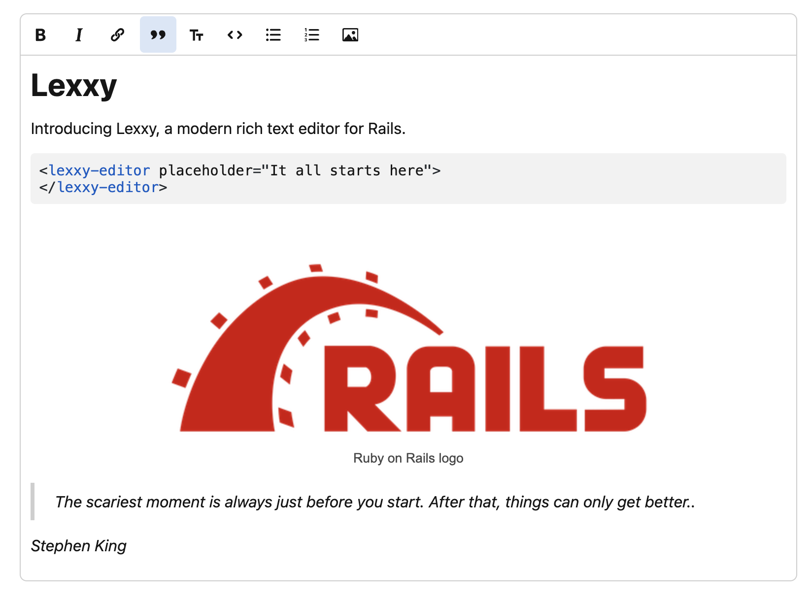

# Lexxy

A modern rich text editor for Rails.

> [!IMPORTANT]  
> This is an early beta. It hasn't been battle-tested yet. Please try it out and report any issues you find.

## Installation

Add this line to your application's Gemfile:

```ruby
gem 'lexxy'
```

And then execute:

```bash
bundle install
```

## Features

- Built on top of [Lexical](https://lexical.dev), the powerful text editor framework from Meta.
- Good HTML semantics. Paragraphs are real `<p>` tags, as they should be.
- Markdown support: shortcuts, auto-formatting on paste.
- Real-time code syntax highlighting.
- Create links by pasting URLs on selected text.
- Configurable prompts. Support for mentions and other interactive prompts with multiple loading and filtering strategies.
- Preview attachments like PDFs and Videos in the editor.
- Works seamlessly with Action Text, generating the same canonical HTML format it expects for attachments.



## Configuration

You can add a Lexxy instance using the regular Action Text form helper:

```erb
<%= form_with model: @post do |form| %>
  <%= form.rich_text_area :content %>
<% end %>
```

Under the hood, this will insert a `<lexxy-editor>` tag, that will be a first-class form control:

```html
<lexxy-editor name="post[body]"...>...</lexxy-editor>
```

## Options

The `<lexxy-editor>` element supports these options:

- `placeholder` - Text displayed when the editor is empty.
- `toolbar` - Pass `"false"` to disable the toolbar entirely, or pass an element ID to render the toolbar in an external element. By default, the toolbar is bootstrapped and displayed above the editor.
- `attachments` - Pass `"false"` to disable attachments completely. By default, attachments are supported, including paste and Drag & Drop support.

Lexxy uses the `ElementInternals` API to participate in HTML forms as any standard control. This means that you can use standard HTML attributes like `name`, `value`, `required`, `disabled`, etc.

## Prompts

Prompts let you implement features like @mentions, /commands, or any other trigger-based suggestions. When you select an item from the prompt, you have two options:

1. Insert the item as an [Action Text custom attachment](https://guides.rubyonrails.org/action_text_overview.html#signed-globalid). This allows you to use standard Action Text to customize how it renders or processes them on the server side.
2. Insert the item as free text in the editor.

Lexxy also lets you configure how to load the items: inline or remotely, and how to do the filtering (locally or on the server).

### General setup

The first thing to do is to add a `<lexxy-prompt>` element to the editor:

```erb
<%= form_with model: @post do |form| %>
  <lexxy-prompt trigger="@">
  </lexxy-prompt>
<% end %>
```

The `trigger` option determines which key will open the prompt. A prompt can load its items from two sources:

- Inline, by defining the items inside the `<lexxy-prompt>` element.
- Remotely, by setting a `src` attribute with an endpoint to load the items.

Regardless of the source, the prompt items are defined using `<lexxy-prompt-item>` elements. A basic prompt item looks like this:

```html
<lexxy-prompt-item search="...">
  <template type="menu">...</template>
  <template type="editor">
    ...
  </template>
</lexxy-prompt-item>
```

Where:

* `search` contains the text to match against when filtering.
* `template[type= "menu"]` defines how the item appears in the dropdown menu.
* `template[type= "editor"]` defines how the item appears in the editor when selected.

### Custom attachments with inline loading

Imagine you want to implement a *mentions* feature, where users can type "@" and select a person to mention. You want to save mentions as action text attachments for further server-side processing when the form is submitted.

First, you need to include the `ActionText::Attachable` concern in your model.

```ruby
# app/models/person.rb
class Person < ApplicationRecord
  include ActionText::Attachable
end
```

By default, the partial to render the attachment will be looked up in `app/views/[model plural]/_[model singular].html.erb`. You can customize this by implementing `#to_attachable_partial_path` in the model. Let's go with the default and render a simple view that renders the person's name and initials:

```erb
# app/views/people/_person.html.erb
<em><%= person.name %></em> (<strong><%= person.initials %></strong>)
```

On the editor side, let's start with the *inline* approach by rendering all the prompt items inside the `<lexxy-prompt>` element:

```erb
<%= form.rich_text_area :body do %>
  <lexxy-prompt trigger="@" name="mention">
    <%= render partial: "people/prompt_item", collection: Person.all, as: :person %>
  </lexxy-prompt>
<% end %>
```

With `app/views/people/_prompt_item.html.erb` defining each prompt item:

```erb
<lexxy-prompt-item search="<%= "#{person.name} #{person.initials}" %>" sgid="<%= person.attachable_sgid %>">
  <template type="menu"><%= person.name %></template>
  <template type="editor">
    <%= render "people/person", person: person %>
  </template>
</lexxy-prompt-item>
```

Notice how the template for rendering the editor representation (`type=" editor") uses the same template as the attachment partial. This way, you ensure consistency between how the mention looks in the editor and how it will render when displaying the text in view mode with Action Text.

Two important additional notes to use action text with custom attachments:

* Each `<lexxy-prompt-item>` must include a `sgid` attribute with the [global id that Action Text will use to find the associated model](https://guides.rubyonrails.org/action_text_overview.html#signed-globalid).
* The `<lexxy-prompt>` must include a `name` attribute that will determine the content type of the attachment. For example, for `name= "mention"`, the attachment will be saved as `application/vnd.actiontext.mention`.

### Custom attachments with remote loading

For moderately large sets, you can configure Lexxy to load all the options from a remote endpoint once, and filter them locally as the user types. This is a good balance between performance and responsiveness.

Continuing with the mentions example, we could have a controller action that returns all people as prompt items, and configure it as the remote source via the `src` attribute:

```erb
<lexxy-prompt trigger="@" src="<%= people_path %>" name="mention">
</lexxy-prompt>
```

We could define the controller action to serve the prompt items like this:

```ruby
class PeopleController < ApplicationController
  def index
    @people = Person.all
    
    render layout: false
  end
end
```

And the action would just list the prompt items:

```erb
<% @people.each do |person| %>
  <%= render "people/prompt_item", person: person %>
<% end %>
```

### Free HTML attachments

If you don't want to use custom action text attachments, you can configure prompts to simply insert the prompt item HTML directly in the editor. This is useful for things like hashtags, emojis, or other inline elements that don't require server-side processing.

To enable these, you must add the `insert-editable-text` attribute to the `<lexxy-prompt>` element:

```erb
<lexxy-prompt trigger="@" src="<%= people_path %>" insert-editable-text>
</lexxy-prompt>
```

When configured like this,if you select an item from the prompt, the content of the `template[type= "editor"]` will be inserted directly in the editor as HTML you can edit freely, instead of as an `<action-text-attachment>` element. Notice that in this case, you need to make sure that the HTML is compatible with the tags that Lexxy supports.

### Remote filtering

There are scenarios where you want to query the server for filtering, instead of loading all options at once. This is useful for large datasets or complex searches. In this case, you must add the `remote-filtering` attribute to the `<lexxy-prompt>` element:

```erb
<lexxy-prompt trigger="@" src="<%= people_path %>" name="mention" remote-filtering>
</lexxy-prompt>
```

By default, the `SPACE` key will select the current item in the prompt. If you want to allow spaces in the search query, you can add the `supports-space-in-searches` attribute to the prompt. This can be handy to search by full names in combination with remote filtering.

### Prompt Options reference

#### `<lexxy-prompt>`

- `trigger` - The character that activates the prompt (e.g., "@", "#", "/").
- `src` - Path or URL to load items remotely.
- `name` - Identifier for the prompt type (determines attachment content type, e.g., `name= "mention"` creates `application/vnd.actiontext.mention`). Mandatory unless using `insert-editable-text`.
- `empty-results` - Message shown when no matches found. By default it is "Nothing found".
- `remote-filtering` - Enable server-side filtering instead of loading all options at once.
- `insert-editable-text` - Insert prompt item HTML directly as editable text instead of Action Text attachments.
- `supports-space-in-searches` - Allow spaces in search queries (useful with remote filtering for full name searches).

#### `<lexxy-prompt-item>`

- `search` - The text to match against when filtering (can include multiple fields for better search).
- `sgid` - The signed GlobalID for Action Text attachments (use `attachable_sgid` helper). Mandatory unless using `insert-editable-text`.

## Roadmap

This is an early beta. Here's what's coming next:

- Configurable editors in Action Text - Choose your editor like you choose your database.
- Image galleries - The only remaining feature for full Action Text compatibility
- Standalone JS package - to use in non-Rails environments.
- Enhanced editing features:
    - Tables
    - Text highlighting

## Development

To build the JS source when it changes, run:

```bash
yarn build -w
```

To the sandbox app:

```bash
bin/rails server
```

The sandbox app is available at http://localhost:3000. There is also a CRUD example at http://localhost:3000/posts.

## Contributing

- Bug reports and pull requests are welcome on [GitHub Issues](https://github.com/basecamp/lexxy/issues). Help is especially welcome with [those tagged as "Help Wanted"](https://github.com/basecamp/lexxy/issues?q=is%3Aissue%20state%3Aopen%20label%3A%22help%20wanted%22).
- For questions and general Lexxy discussion, please use the [Discussions section](https://github.com/basecamp/lexxy/discussions)

## License

The gem is available as open source under the terms of the [MIT License](https://opensource.org/licenses/MIT).
